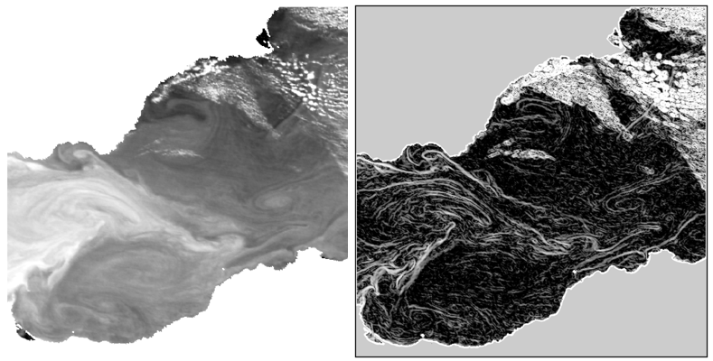
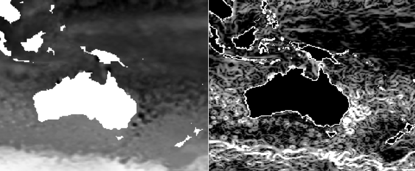

**Motivation**

This module can be used to process all kind of data, as long as the input is a 2D array (it can be a black and white picture, SST, altimetry, chlorophyll ...), but is appropriate for the L2 Aqua-MODIS SST data. In an oceanographical context, the Singularity Exponents (SE) computation can lead to an analysis of some particular shapes of structures. The SE study is comparable to the one of the gradients, but it can be more relevant in the sense it uses a pixel by pixel approach, that leads to a dimensionless number, that can detect more precisely some anomalies. 

**Prerequisites**

In addition to Python, a fortran compiler as gfortran is required, as well as the [netCDF4](https://github.com/Unidata/netcdf4-python) and [Basemap](https://matplotlib.org/basemap/) Python libraries.

**Installation/Running**

Open a terminal in the folder with the .py and .f90 downloaded files.

To initialize the f2py module, run:

> f2py -c -m loop_SE_fortran loop_SE_fortran.f90

To play (computation, plots, anomalies enlightenment with different functions) with the computed Singularity Exponents from a L2 SST data downloaded from the [NASA OceanColor website]( https://oceancolor.gsfc.nasa.gov/cgi/browse.pl), change the filename in the *make_SE_module.py* script, and run:

> ipython
> In [1]: %run make_SE_module.py

Two netCDF files are available in the folder: "A2017206020500.L2_LAC_SST4.nc" and "SE_2017206.nc". The first one has been downloaded on the [NASA OceanColor website]( https://oceancolor.gsfc.nasa.gov/cgi/browse.pl) and is a L2 SST4 Aqua-MODIS netCDF file of the Western Mediterranean Sea of the 25/07/17. The second one is the output file containing the Singularity Exponents computed values on a zoom of the Alborán Sea. These are the input/output files used/obtained in the Jupyter Notebook that follows. The example plot in the folder comes also from this file.

**IPython Jupyter Notebook**

To get another approach of the function, an Jupyter notebook (compute_SE_SST.ipynb) is available on the folder. At the end, you should get this kind of outputs for the SST/SE computation:

An other notebook is available (compute_SE_ADT.ipynb) to show and explain the module can be use with different kind of input data. The results for the ADT/SE computation should be like:

**Further work**

The updates to come are to extend the cloud areas to erase to frontal detection areas at the limit between clouds and the sea for the L2 SST data. For the ADT input, as it is a L4 product and there is no cloud, the frontal detection is possible. Thus, a useful automatic frontal detection software is created.

**Acknowledgements**

This module has been developed during an internship at IMEDEA (CSIC-UIB) in Mallorca, Spain, in 2017, under the supervision of Ananda Pascual and Simón Ruiz, and with the help of Evan Mason (@evanmason) and Guillaume Charria (Ifremer).

Oriol Pont, Antonio Turiel, and Hussein Yahia. An Optimized Algorithm for the Evaluation of Local Singularity Exponents in Digital Signals, pages 346–357. Springer Berlin Heidelberg, Berlin, Heidelberg, 2011. 

Özge Yelekçi, Guillaume Charria, Xavier Capet, Gilles Reverdin, Joël Sudre, and Hussein Yahia. Spatial and seasonal distributions of frontal activity over the french continental shelf in the bay of biscay. Continental Shelf Research, 144(Supplement C):65 – 79, 2017.

NASA Goddard Space Flight Center, Ocean Ecology Laboratory, Ocean Biology Processing Group. Moderate-resolution Imaging Spectroradiometer (MODIS) Aqua {L2 SST} Data; NASA OB.DAAC, Greenbelt, MD, USA.
Accessed on 10/19/2017.

ADT images generated using E.U. Copernicus Marine Service Information. CMEMS product : SEALEVEL_GLO_PHY_L4_NRT_OBSERVATIONS_008_046
