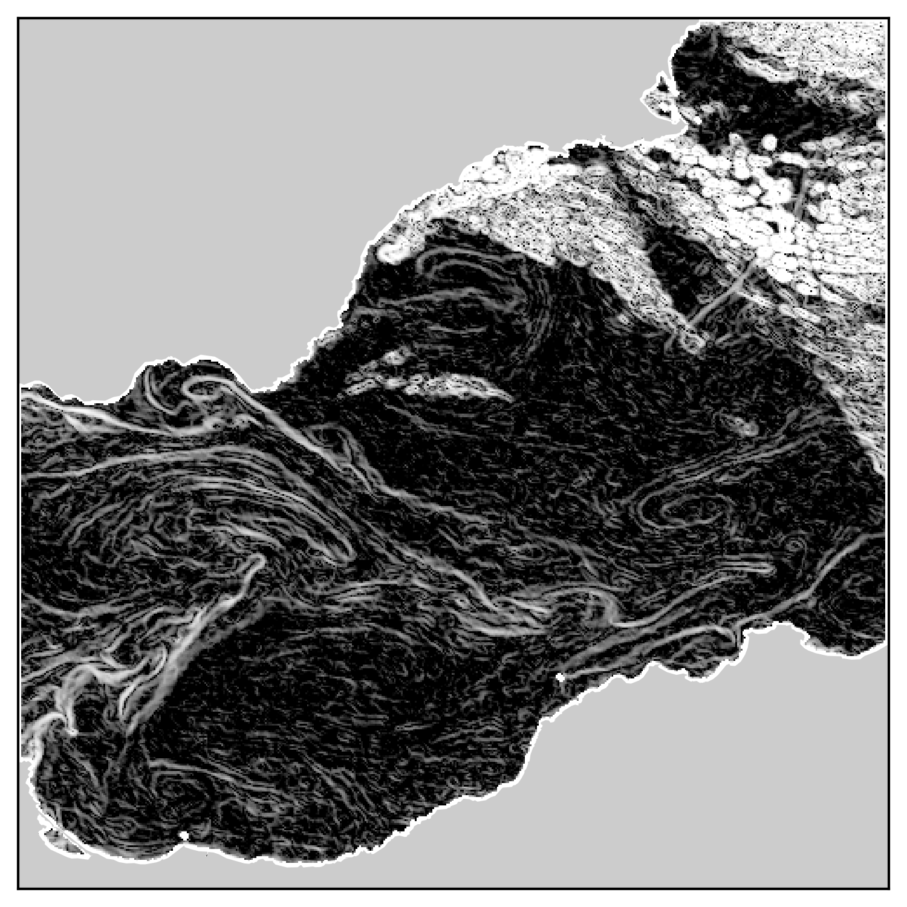

**Motivation**

This module can be used to process all kind of data, as long as the input is a 2D array (it can be a black and white picture, SST, altimetry, chlorophyll ...), but is appropriate for the L2 Aqua-Modis SST data. In an oceanographical context, the Singularity Exponents (SE) computation can lead to an analysis of some particular shapes of structures. The SE study is comparable to the one of the gradients, but it can be more relevant in the sense it uses a pixel by pixel approach, that lead to a dimensionless number, that can detect more precisely some anomalies. 

**Prerequisites**

In addition to Python, a fortran compiler as gfortran is required, as well as the netCDF4 and Basemap Python libraries.

**Installation/Running**

Open a terminal in the folder with the .py and .f90 downloaded files.

To initialize the f2py module, run:

> f2py -c -m loop_SE_fortran loop_SE_fortran.f90

To play (computation, plots, anomalies enlightment with different functions) with the computed Singularity Exponents from a L2 SST data downloaded from the [NASA oceancolor website]( https://oceancolor.gsfc.nasa.gov/cgi/browse.pl), change the filename in the *make_SE_fortran_EastMed_2RUN.py* script, and run:

> ipython
> In [1]: %run make_SE_module.py

**IPython Notebook**

To get another approach of the function, an Ipython notebook (compute_SE_SST.ipynb) is available on the folder. At the end, you should get this kind of outputs:

**Acknowledgements**

Oriol Pont, Antonio Turiel, and Hussein Yahia. An Optimized Algorithm for the Evaluation of Local Singularity Exponents in Digital Signals, pages 346–357. Springer Berlin Heidelberg, Berlin, Heidelberg, 2011.

Özge Yelekçi, Guillaume Charria, Xavier Capet, Gilles Reverdin, Joël Sudre, and Hussein Yahia. Spatial and seasonal distributions of frontal activity over the french continental shelf in the bay of biscay. Continental Shelf Research, 144(Supplement C):65 – 79, 2017.

NASA Goddard Space Flight Center, Ocean Ecology Laboratory, Ocean Biology Processing Group. Moderate-resolution Imaging Spectroradiometer (MODIS) Aqua {L2 SST} Data; NASA OB.DAAC, Greenbelt, MD, USA.
Accessed on 10/19/2017# SingularityExponents
